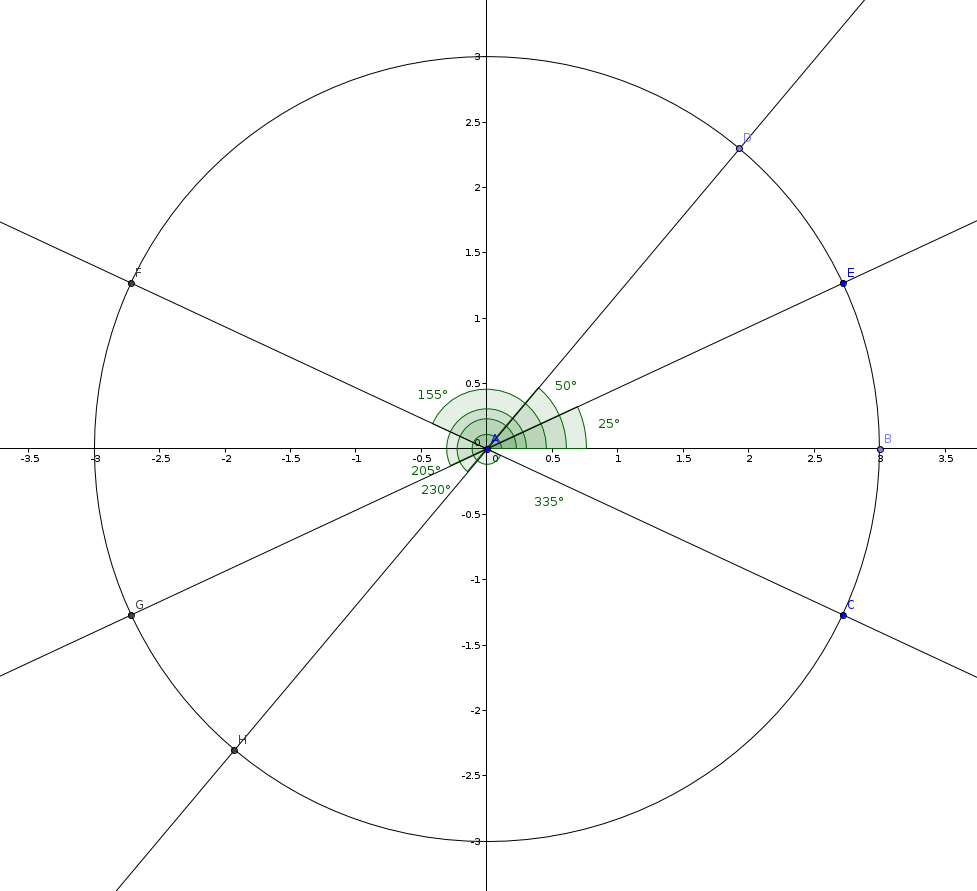

# Angle_Average

Computes the average slope of lines as an angle, given the slopes of each line (as angles) in a list.

## Example

Note that in the following example there are two lines:
* line with slope 10 degrees (which is the same as 190 degrees)
* line with slope 30 degrees (which is the same as 210 degrees)

When computing the average using any of the two possible slope representations, the resulting slope (angle) should be the same
* average (10, 30) = 20
* average (10, 210) = 20 
* average (190, 30) = 20 
* average (190, 210) = 20 

## Instructions:

Use the provided function as follows:
	
	from Angle_Average import average_angle
	# list_angles: provides a list of angles as input
	# specify if the input and output are in radians ('rad') or degrees ('deg')
	result = average_angle(list_angles, angle_type = 'deg')

